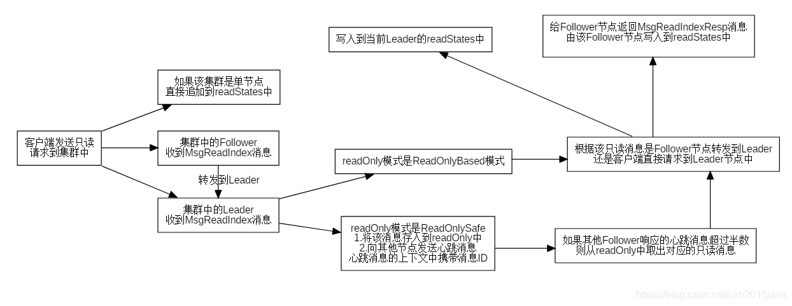
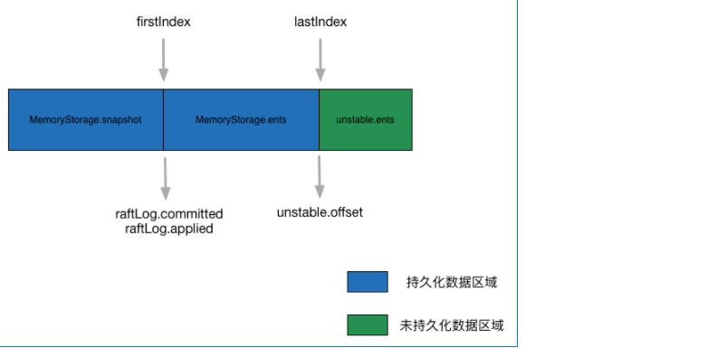

# etcd

v3.5.2 Etcd是分布式系统中最关键的数据的可靠的分布式键值存储,其重点是:

自己看源码 用 2379:为客户端提供通讯 2380:为服务器间提供通讯


### 配置

```
peer-cert-allowed-cn    允许的客户端证书CommonName    your name or your server's hostname
```

## 空间占用整理

```模拟 
设置etcd存储大小
etcd --quota-backend-bytes=$((16*1024*1024))

写爆磁盘
while [ 1 ]; do dd if=/dev/urandom bs=1024 count=1024 | etcdctl put key || break;done

查看endpoint状态
etcdctl --write-out=table endpoint status

查看alarm
etcdctl alarm list

清理碎片
etcdctl defrag

清理alarm
etcdctl alarm disarm

获取当前etcd数据的修订版本(revision)
rev=$(etcdctl -w json endpoint status | egrep -o -i '"revision":[0-9]*' | egrep -o '[0-9]*')
整合压缩旧版本数据
etcdctl compact $rev
执行碎片整理
etcdctl defrag
解除告警
etcdctl alarm disarm
备份以及查看备份数据信息
etcdctl snapshot save backup.db
etcdctl snapshot status backup.db
```

```
//--auto-compaction-mode=revision --auto-compaction-retention=1000 每5分钟自动压缩"latest revision" - 1000；
//--auto-compaction-mode=periodic --auto-compaction-retention=12h 每1小时自动压缩并保留12小时窗口.
👁etcd_backend/embed/config_test.go:TestAutoCompactionModeParse

- 只保存一个小时的历史版本`etcd --auto-compaction-retention=1`
- 只保留最近的3个版本`etcdctl compact 3`
- 碎片整理`etcdctl defrag`
```

### URL

```
http://127.0.0.1:2379/members

```

### msgType

| 消息类型 | 处理方 | 描述 | | :--- | :--- | :--: | | MsgHup | 节点支持 | 本地：开启选举,---->会触发vote或pre-vote | | MsgBeat | Leader |
本地：心跳,---->给peers发送Msghearbeat | | MsgProp | Leader、Candidate、Follower | 本地：Propose -----> MsgApp | | MsgApp |
Candidate、Follower | 非本地：操作日志【复制、配置变更 req】 | | MsgAppResp | Leader | 非本地：操作日志【复制 res】 | | MsgVote | 节点支持 | 非本地：投票请求 | |
MsgVoteResp | Candidate | 非本地：投票相应 | | MsgPreVote | 节点支持 | 非本地：预投票请求 | | MsgPreVoteResp | Candidate | 非本地：预投票相应 | |
MsgSnap | Candidate、Follower | 非本地：leader向follower拷贝快照,响应是MsgAppResp,告诉leader继续复制之后的值 | | MsgHeartbeat |
Candidate、Follower | | | MsgHeartbeatResp | Leader | | | MsgUnreachable | Leader |
非本地：etcdserver通过这个消息告诉raft状态机某个follower不可达,让其发送消息的方式由pipeline切成ping-pong模式 | | MsgSnapStatus | Leader |
非本地：etcdserver通过这个消息告诉raft状态机快照发送成功还是失败 | | MsgCheckQuorum | Leader | | | MsgTransferLeader | Leader、Follower | 非本地： | |
MsgTimeoutNow | Candidate、Follower | 非本地： | | MsgReadIndex | Leader、Follower | 非本地： | | MsgReadIndexResp | Follower |
非本地： |

### issue

- 1、CertFile与ClientCertFile KeyFile与ClientKeyFile的区别
  ```
  在运行的过程中是配置的相同的;
  一般情况下,client与server是使用相同的ca进行的签发,   所有server端可以使用自己的私钥与证书验证client证书
  但如果不是同一个ca签发的; 那么就需要一个与client相同ca签发的证书文件与key
  
  ```
- 2、url
  ```
  
  	ErrUnsetAdvertiseClientURLsFlag = fmt.Errorf("--advertise-client-urls is required when --listen-client-urls is set explicitly")
	ErrLogRotationInvalidLogOutput  = fmt.Errorf("--log-outputs requires a single file path when --log-rotate-config-json is defined")
  
    --data-dir 指定节点的数据存储目录,这些数据包括节点ID,集群ID,集群初始化配置,Snapshot文件,若未指定—wal-dir,还会存储WAL文件;
    --wal-dir 指定节点的was文件的存储目录,若指定了该参数,wal文件会和其他数据文件分开存储.
  # member  
    这个参数是etcd服务器自己监听时用的,也就是说,监听本机上的哪个网卡,哪个端口
    --listen-client-urls        DefaultListenClientURLs = "http://192.168.1.100:2379"
    和成员之间通信的地址.用于监听其他etcd member的url
    --listen-peer-urls          DefaultListenPeerURLs   = "http://192.168.1.100:2380"
  
  # cluster
    就是客户端(etcdctl/curl等)跟etcd服务进行交互时请求的url
    --advertise-client-urls             http://127.0.0.1:2379,http://192.168.1.100:2379,http://10.10.10.10:2379      
    集群成员的 URL地址.且会通告群集的其余成员节点.  
    --initial-advertise-peer-urls       http://127.0.0.1:12380       告知集群其他节点url.           
    # 集群中所有节点的信息
    --initial-cluster 'infra1=http://127.0.0.1:12380,infra2=http://127.0.0.1:22380,infra3=http://127.0.0.1:32380' 
  
  
    请求流程:
    etcdctl endpoints=http://192.168.1.100：2379 --debug ls
    首先与endpoints建立链接, 获取配置在advertise-client-urls的参数
    然后依次与每一个地址建立链接,直到操作成功
  
  
      --advertise-client-urls=https://192.168.1.100:2379
      --cert-file=/etc/kubernetes/pki/etcd/server.crt
      --client-cert-auth=true
  
      --initial-advertise-peer-urls=https://192.168.1.100:2380
      --initial-cluster=k8s-master01=https://192.168.1.100:2380
  
      --key-file=/etc/kubernetes/pki/etcd/server.key
      --listen-client-urls=https://127.0.0.1:2379,https://192.168.1.100:2379
      --listen-metrics-urls=http://127.0.0.1:2381
      --listen-peer-urls=https://192.168.1.100:2380
  
      --name=k8s-master01
  
      --peer-cert-file=/etc/kubernetes/pki/etcd/peer.crt
      --peer-client-cert-auth=true
      --peer-key-file=/etc/kubernetes/pki/etcd/peer.key
  
      --peer-trusted-ca-file=/etc/kubernetes/pki/etcd/ca.crt
      --trusted-ca-file=/etc/kubernetes/pki/etcd/ca.crt
    initial-advertise-peer-urls与initial-cluster要都包含
  
  ```
- 3 JournalLogOutput 日志
  ```
  systemd-journal是syslog 的补充,收集来自内核、启动过程早期阶段、标准输出、系统日志、守护进程启动和运行期间错误的信息,
  它会默认把日志记录到/run/log/journal中,仅保留一个月的日志,且系统重启后也会消失.
  但是当新建 /var/log/journal 目录后,它又会把日志记录到这个目录中,永久保存.
  ```


- checkquorum 过半机制：
  ```
  每隔一段时间,leader节点会尝试连接集群中的节点(发送心跳),如果发现自己可以连接到的节点个数没有超过半数,则主动切换成follower状态.
  这样在网络分区的情况下,旧的leader节点可以很快的知道自己已经过期了.
  ```


- PreVote优化
  ```
  当follower节点准备发起选举时候,先连接其他节点,并询问它们是否愿意参与选举(其他人是否能正常收到leader节点的信息),当有半数以上节点响应并参与则可以发起新一轮选举.
  解决分区之后节点重新恢复但term过大导致的leader选举问题
  ```
- WAL
  ```
  WAL全称是Write Ahead Log,是数据库中常用的持久化数据的方法.比如我们更新数据库的一条数据,如果直接找到这条数据并更新,
  可能会耗费比较长的时间.更快更安全的方式是先写一条Log数据到文件中,然后由后台线程来完成最终数据的更新,这条log中通常包含的是一条指令.
  ```
- 发送心跳消息的时候leader是怎么设置各个follower的commit?

- leader收到follower的心跳响应之后会怎么去修改对应的follower元数据呢?

- 快照 follower 当数据远落后于leader , leader会将快照发送过来 但由于网络原因,这一过程很慢 ,但是leader又生成了新的快照,wal没有旧的数据, 这时follower同步完,leader将最新新消息
  发送follower , follower reject ,但是此时wal已经没有对应的wal 又会发送新的快照, 这就会陷入死循环.....how? 看完源码再说吧
  
- JointConfig 为什么是两个
- 哪些场景会出现 Follower 日志与 Leader 冲突?
  ```
  leader崩溃的情况下可能(如老的leader可能还没有完全复制所有的日志条目),如果leader和follower出现持续崩溃会加剧这个现象.
  follower可能会丢失一些在新的leader中有的日志条目,他也可能拥有一些leader没有的日志条目,或者两者都发生.
  ```
- follower如何删除无效日志?
  ```
  leader处理不一致是通过强制follower直接复制自己的日志来解决了.因此在follower中的冲突的日志条目会被leader的日志覆盖.
  leader会记录follower的日志复制进度nextIndex,如果follower在追加日志时一致性检查失败,就会拒绝请求,此时leader就会减小 nextIndex 值并进行重试,最终在某个位置让follower跟leader一致.
  ```
- 为什么WAL日志模块只通过追加,也能删除已持久化冲突的日志条目呢? 
  ```
  其实这里 etcd 在实现上采用了一些比较有技巧的方法,在 WAL 日志中的确没删除废弃的日志条目,你可以在其中搜索到冲突的日志条目.
  只是 etcd 加载 WAL 日志时,发现一个 raft log index 位置上有多个日志条目的时候,会通过覆盖的方式,将最后写入的日志条目追加到 raft log 中,
  实现了删除冲突日志条目效果
  https://github.com/etcd-io/etcd/issues/12589
  ```

(2) electionElapsed

当 electionElapsed 超时,发送 MsgCheckQuorum 给当前节点,当前节点收到消息之后,进行自我检查,判断是否能继续维持 Leader 状态,如果不能切换为Follower.同时如果节点正在进行 Leader 切换(
切换其他节点为Leader),当 electionElapsed 超时,说明 Leader 节点转移超时,会终止切换.

```
curl    --------http--------->    gateway ------------> etcd grpc server 2379
                            将http转换成了grpc


127.0.0.1:2379
1、HTTP2
2、HTTP1     

```

### module

- github.com/soheilhy/cmux 可以在同一个listener上监听不同协议的请求
-

```
etcdServer 会单独处理 Propose消息, 其余消息交给raft.step 来处理 [该函数,会随着节点角色的改变而发生改变] [会首先判断任期、索引,在判断消息类型]

StartEtcd
  1、etcdserver.NewServer -> 
      heartbeat := time.Duration(cfg.TickMs) * time.Millisecond
      MySelfStartRaft
        newRaftNode
          r.ticker = time.NewTicker(r.heartbeat)                创建定时器、心跳
        startNode -> 
          raft.StartNode -> 
            go n.run()
              rd = n.rn.readyWithoutAccept()                      获取待发送消息,会获取到r.msgs
              readyc = n.readyc                                   待发送消息channel 
              - case pm := <-propc                                网络发来的消息、除Propose消息
              - case m := <-n.recvc                               G 处理来自peer的消息 
              - case cc := <-n.confc
              - case <-n.tickc                                    F取出数据
                  n.rn.Tick()
                    rn.raft.tick()                                根据角色调用自己的函数
                      - r.tickElection 
                          r.Step(pb.Message{From: r.id, Type: pb.MsgHup}) 该函数是处理所有到来消息的入口
                            r.send(pb.Message
                              r.msgs = append(r.msgs, m)          放入要发送的消息
                      - r.tickHeartbeat
                          r.Step(pb.Message{From: r.id, Type: pb.MsgCheckQuorum})
              - case readyc <- rd                                                   A放入数据
              - case <-advancec: 
              - case c := <-n.status:
              - case <-n.stop: 
      tr.AddPeer  
        startPeer                                                 与每个peer都建立一个链接
          r.Process
            s.Process
              s.r.Step(ctx, m)
                n.step
                  stepWithWaitOption
                    case n.recvc <- m                             G 接收来自peer的消息 
        
  2、e.Server.Start ->
    EtcdServer.strat ->
      s.start()
        go s.run() 
            --> | # s.r=raftNode
            --> | s.r.start(rh)
            --> |   go func()
            --> |     - case <-r.ticker.C:                          接收定时器信号
            --> |       r.tick() 
            --> |         r.Tick()
            --> |           case n.tickc <- struct{}{}              F放入数据、不会阻塞,有size
            --> |     - case rd := <-r.Ready()                      获取可以发送的数据     A取出数据  
                          case r.applyc <- ap                                           B放入数据
                          r.transport.Send(msgs)                        发出响应数据
            --> |     - case <-r.stopped:
            
          - case ap := <-s.r.apply()                                                   B取出数据
              读取applyc的数据,封装为JOB,放入调度器
          - case leases := <-expiredLeaseC
              处理过期租约
          - case err := <-s.errorc
              处理运行过程中出现的err,直接退出
          - getSyncC
          - case <-s.stop:
              启动过程中失败
    
  3、e.servePeers
  4、e.serveClients
  5、e.serveMetrics
    
```



```
快照 + storage + unstable 的区别
compacted <--- compacted <--- applied <--- committed <--- stable <--- unstable
WAL 日志 
11 12 13 14 15 16 17 18 19 20 21 22 23 24 25 26 27 28 29 30 31 32 33 34 35 36 37 38 39 40 41 42 43 44 45 46
-------------------------------------------------------------------|--MemoryStorage|file--|-----------------
-----压缩---------|---------------压缩---------------------|-------------------------------------------------
----快照----------------- |----------------快照--------------------- | storage: 落盘的       | unstable 内存中的  
----快照----------------- |----------------快照--------------------- |         | 在没有被持久化之前如果遇到了换届选举,这个日志可能会被相同索引值的新日志覆盖


每一条日志Entry需要经过unstable、stable、committed、applied、compacted五个阶段,接下来总结一下日志的状态转换过程：

刚刚收到一条日志会被存储在unstable中,日志在没有被持久化之前如果遇到了换届选举,这个日志可能会被相同索引值的新日志覆盖,这个一点可以在raftLog.maybeAppend()和unstable.truncateAndAppend()找到相关的处理逻辑.
unstable中存储的日志会被使用者写入持久存储（文件）中,这些持久化的日志就会从unstable转移到MemoryStorage中.
读者可能会问MemoryStorage并不是持久存储啊,其实日志是被双写了,文件和MemoryStorage各存储了一份,而raft包只能访问MemoryStorage中的内容.这样设计的目的是用内存缓冲文件中的日志,在频繁操作日志的时候性能会更高.
此处需要注意的是,MemoryStorage中的日志仅仅代表日志是可靠的,与提交和应用没有任何关系.
leader会搜集所有peer的接收日志状态,只要日志被超过半数以上的peer接收,那么就会提交该日志,peer接收到leader的数据包更新自己的已提交的最大索引值,这样小于等于该索引值的日志就是可以被提交的日志.
已经被提交的日志会被使用者获得,并逐条应用,进而影响使用者的数据状态.
已经被应用的日志意味着使用者已经把状态持久化在自己的存储中了,这条日志就可以删除了,避免日志一直追加造成存储无限增大的问题.不要忘了所有的日志都存储在MemoryStorage中,不删除已应用的日志对于内存是一种浪费,这也就是日志的compacted.

每次用户提交日志,该日志会保存到 MemoryStorage 以及wal里,每当raft发送给上层程序一批已经commited日志,就会触发maybeTriggerSnapshot,当用户apply以后
判断是否进行触发 MemoryStorage 打快照,当打了快照以后,会把当前快照点10000条以前的记录从 MemoryStorage.ents去除掉 【俗称压缩】


MemoryStorage并不是持久存储啊,其实日志是被双写了,文件和MemoryStorage各存储了一份,
而raft包只能访问MemoryStorage中的内容.这样设计的目的是用内存缓冲文件中的日志,在频繁操作日志的时候性能会更高.
此处需要注意的是,MemoryStorage中的日志仅仅代表日志是可靠的,与提交和应用没有任何关系.
```

## Compact

```
1、新建Snapshot之后,一般会调用MemoryStorage.Compact()方法将MemoryStorage.ents中指定索引之前的Entry记录全部抛弃,
从而实现压缩MemoryStorage.ents 的目的,具体实现如下：    [GC]
func (ms *MemoryStorage) Compact(compactIndex uint64) 

2、清除kvindex的修订版本,以及bolt.db里的历史数据


```

### WAl数据日志数据

```
type Record struct {
    Type                 int64   
    Crc                  uint32  
    Data                 []byte   
}
- metadataType  :1  元数据类型,元数据会保存当前的node id和cluster id.
    type Metadata struct {
        NodeID    uint64
        ClusterID uint64
    }
- entryType     :2  日志条目
    type Entry struct {
        Term  uint64
        Index uint64
        Type  EntryType  
                EntryNormal
                  # msgType
                EntryConfChange   
                EntryConfChangeV2 
        Data  []byte 
              msg 👆🏻
    }
- stateType     :3  当前Term,当前竞选者、当前已经commit的日志.
- crcType       :4  存放crc校验字段 Data为nil
- snapshotType  :5  快照的、日志的Index和Term
    type Snapshot struct {
        Index     uint64
        Term      uint64
        ConfState *raftpb.ConfState
    }
```

```
raft commit->apply  的数据 封装在ready结构体里   <-r.Ready()
    raftNode拿到该ready做一些处理,过滤出操作日志   publishEntries
        上层应用拿到过滤后的,将其应用到kvstore【【
```

### 集群节点变更

```
1、先检查是否有待应用的变更
2、将变更信息放入raft unstable 等待发送----->发送,等到apply
3、apply 该变更
case rd := <-r.Ready(): 从raft拿到要apply的消息
  case r.applyc <- ap:
       go:
       - ap := <-s.r.apply()
        - s.applyAll(&ep, &ap)
         - s.applyEntries(ep, apply)
          - s.apply(ents, &ep.confState)
           - case raftpb.EntryConfChange:
            - s.applyConfChange(cc, confState, shouldApplyV3)
             - *s.r.ApplyConfChange(cc)     获取应用配置变更之后的集群状态      
              - cs := r.applyConfChange(cc) 返回应用配置变更之后的集群状态,已生效,只更新了quorum.JointConfig与peer信息
               - r.switchToConfig(cfg, prs) 
             -
               | s.cluster.PromoteMember 
               | s.cluster.AddMember                    -----> 更新v2store[memory node tree]、backend[bolt.db] 
               | s.cluster.RemoveMember                                     |---> 触发watcher
               | s.cluster.UpdateRaftAttributes 


r.Advance()

```

curl -H "X-Etcd-Cluster-ID:cdf818194e3a8c32" -H "X-PeerURLs:http://127.0.0.1:12345" -H "X-Min-Cluster-Version: 3.5.2"
-H "X-Server-Version:3.5.2" http://localhost:2380/raft/stream/message/8e9e05c52164694d
curl -X "POST" -H "X-Server-From:8e9e05c52164694d" "-H "X-Etcd-Cluster-ID:cdf818194e3a8c32" -H "
X-PeerURLs:http://127.0.0.1:12345" -H "X-Min-Cluster-Version: 3.5.2" -H "X-Server-Version:3.5.2"
-d "" http://localhost:2380/raft/stream/snapshot

humanize.Bytes net.SplitHostPort([2001:db8:1f70::999:de8:7648:6e8]:100)->[2001:db8:1f70::999:de8:7648:6e8]

BoltDB本身已经实现了事务的隔离性、原子性、持久化、一致性,并提供了并发的单写+多读

Linearizable、Serializable Linearizable Read (线性读),通俗地讲,就是读请求需要读到最新的已经提交的数据,不会读到旧数据

V3和V2版本的对比 etcd的v2版本有下面的一些问题 Watch 机制可靠性问题 etcd v2 是内存型、不支持保存 key 历史版本的数据库,只在内存中使用滑动窗口保存了最近的 1000 条变更事件,当 etcd server
写请求较多、网络波动时等场景,很容易出现事件丢失问题,进而又触发 client 数据全量拉取,产生大量 expensive request,甚至导致 etcd 雪崩. 性能瓶颈问题 1、etcd v2早起使用的是 HTTP/1.x
API.HTTP/1.x 协议没有压缩机制,大量的请求可能导致 etcd 出现 CPU 高负载、OOM、丢包等问题； 2、etcd v2 client 会通过 HTTP 长连接轮询 Watch 事件,当 watcher 较多的时候,因
HTTP/1.x 不支持多路复用,会创建大量的连接,消耗 server 端过多的 socket 和内存资源； 3、对于 key 中的 TTL过期时间,如果大量 key TTL 一样,也需要分别为每个 key 发起续期操作,当 key
较多的时候,这会显著增加集群负载、导致集群性能显著下降； 内存开销问题 etcd v2 在内存维护了一颗树来保存所有节点 key 及 value.在数据量场景略大的场景,如配置项较多、存储了大量 Kubernetes Events,
它会导致较大的内存开销,同时 etcd 需要定时把全量内存树持久化到磁盘.这会消耗大量的 CPU 和磁盘 I/O 资源,对系统的稳定性造成一定影响. etcd v3 的出现就是为了解决以上稳定性、扩展性、性能问题 1、在内存开销、Watch
事件可靠性、功能局限上,它通过引入 B-tree、boltdb 实现一个 MVCC 数据库,数据模型从层次型目录结构改成扁平的 key-value,提供稳定可靠的事件通知,实现了事务,支持多 key 原子更新,同时基于 boltdb
的持久化存储,显著降低了 etcd 的内存占用、避免了 etcd v2 定期生成快照时的昂贵的资源开销； 2、etcd v3 使用了 gRPC API,使用 protobuf 定义消息,消息编解码性能相比 JSON 超过 2 倍以上,并通过
HTTP/2.0 多路复用机制,减少了大量 watcher 等场景下的连接数； 3、使用 Lease 优化 TTL 机制,每个 Lease 具有一个 TTL,相同的 TTL 的 key 关联一个 Lease,Lease
过期的时候自动删除相关联的所有 key,不再需要为每个 key 单独续期； 4、etcd v3 支持范围、分页查询,可避免大包等 expensive request.

pb.Message.Entries =  [ pb.InternalRaftRequest ]

etcd中每新建一个key ,会为其分配一个主版本,同时还有一个sub版本,长度17byte 格式： 8byte_8byte 例如[00000002_00000000]---> 转换成bolt.db的键值就是
00000000000000025f0000000000000000

### 线性一致性读流程

```
localNode.run() 一直死循环
  判断是否有ready的数据,其中 r.readStates就是一项指标
  n.readyc <- ready 
  
---------------------------------
raftNode.start
  case rd := <-r.Ready():           消费端:  获取ready数据,包含r.ReadStates = r.readStates
    select {
    case r.readStateC <- rd.ReadStates[len(rd.ReadStates)-1]:  // 发送响应数据
    case <-time.After(internalTimeout):
        r.lg.Warn("发送读状态超时", zap.Duration("timeout", internalTimeout))
    case <-r.stopped:
        return
    }
---------------------------------
leader:
    stepLeader;
    case pb.MsgReadIndex:
      1、集群只有一个节点  
        r.readStates = append(r.readStates, ReadState{Index:r.raftLog.committed, RequestCtx: 自增ID})
      2、
        引入pendingReadIndex、readIndexQueue 心跳广播 自增ID 等待大多数据集群节点回应 自增ID
    case pb.MsgHeartbeatResp:    
      rss := r.readOnly.advance(m)       

rd.ReadStates
----------------------------------
linearizableReadLoop                      发送MsgReadIndex消息,
    s.requestCurrentIndex
        1、s.sendReadIndex(自增ID)
            s.r.ReadIndex                 发送pb.MsgReadIndex消息,数据是自增ID
        2、case rs := <-s.r.readStateC:   等待响应   得到ReadState{Index:r.raftLog.committed, RequestCtx: 自增ID}
        return r.raftLog.committed
    r.raftLog.committed >= s.getAppliedIndex()     如果满足这个条件  
    nr.notify(nil)                        相当于往nc.c发消息       
--------------
get
linearizeReadNotify                    线性读,触发linearizableReadLoop,并等待结果
  1、case s.readwaitc <- struct{}{}:      触发线性读 
  2、case <-nc.c:                         等待结果
     return nc.err  
继续在本节点读取数据 
          
```

### 租约检查点机制

```
bug: 
  如果租约在到期前,Leader切换, 那么它的租约会重置
如何解决这个问题
  每过一段时间,将每个key剩余多长时间同步到其他节点的db中,这样如果发生leader切换,租约的误差也只是 这个间隔
  - 定期同步租约剩余时间至其他节点的db
issue:
  第一发送  ttl  10s  remainingTtl  5s
  假设将该消息发送到对端,因为网络问题花了3秒, 那么当对端收到时,实际remainingTtl应该是2s,但还是变成了5s  
- 如果时间这么长,那这个节点肯定出问题了,那么也不会成为leader


作者回复: 
从原理上我们知道lease是leader在内存中维护过期最小堆的,因此续期操作client是必须要直接发送给leader的,
如果follower节点收到了keepalive请求,会转发给leader节点.续期操作不经过raft协议处理同步,
而leaseGrant/Revoke请求会经过raft协议同步给各个节点,因此任意节点都可以处理它.
```

``` 
curl -L http://127.0.0.1:2379/version
curl -L http://192.168.59.156:2379/metrics
etcdctl cluster-health
etcdutl backup --data-dir /var/lib/etcd --backup-dir /tmp/etcd

# no crt 
etcdctl snap save a.db 
etcdctl snapshot restore a.db
# crt
etcdctl snap save --cert=./cert/server.crt --cacert=./cert/ca.crt --key=./cert/server.key a.db 
```

### leader trans

```
Step()
  case pb.MsgVote, pb.MsgPreVote:
    变更leader,....等操作
  
  stepLeader()
    case pb.MsgTransferLeader:
      r.send(pb.Message{To: to, Type: pb.MsgTimeoutNow})  // 给指定的节点发消息
  stepFollower()
    case pb.MsgTimeoutNow:
      r.hup(campaignTransfer)
      # 给每一个节点发送
      r.send(pb.Message{Term: term, To: id, Type: voteMsg, Index: r.raftLog.lastIndex(), LogTerm: r.raftLog.lastTerm(), Context: ctx})

```


证书解析认证性能极低


```

#创建一个admin role 
etcdctl role add admin  --user root:root
#分配一个可读写[hello,helly)范围数据的权限给admin role
etcdctl role grant-permission admin readwrite hello helly --user root:root
# 将用户alice和admin role关联起来,赋予admin权限给user
etcdctl user grant-role alice admin --user root:root
```


etcd 保存用户 key 与版本号映射关系的数据结构 B-tree,为什么 etcd 使用它而不使用哈希表、平衡二叉树?
```
从 etcd 的功能特性上分析, 因 etcd 支持范围查询,因此保存索引的数据结构也必须支持范围查询才行.所以哈希表不适合,而 B-tree 支持范围查询.
从性能上分析,平横二叉树每个节点只能容纳一个数据、导致树的高度较高,而 B-tree 每个节点可以容纳多个数据,
树的高度更低,更扁平,涉及的查找次数更少,具有优越的增、删、改、查性能.
```
你认为 etcd 为什么删除使用 lazy delete 方式呢？ 相比同步 delete, 各有什么优缺点？
```
采用延迟删除
1、为了保证key对应的watcher能够获取到key的所有状态信息，留给watcher时间做相应的处理。
2、实时从boltdb删除key，会可能触发树的不平衡，影响其他读写请求的性能。

etcd要保存key的历史版本，直接删除就不能支持revision查询了；
lazy方式性能更高，空闲空间可以再利用；
```
当你突然删除大量 key 后，db 大小是立刻增加还是减少呢？
```
应该会增大，etcd不会立即把空间返回系统而是维护起来后续使用，维护空闲页面应该需要一些内存；
```